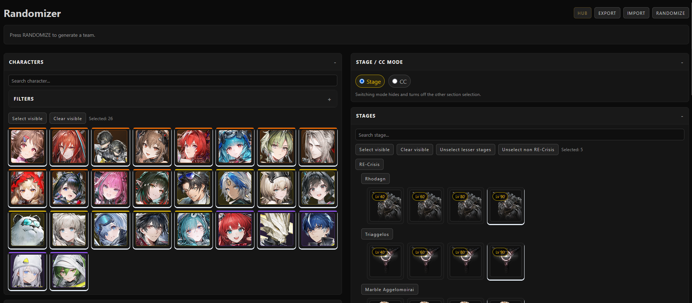
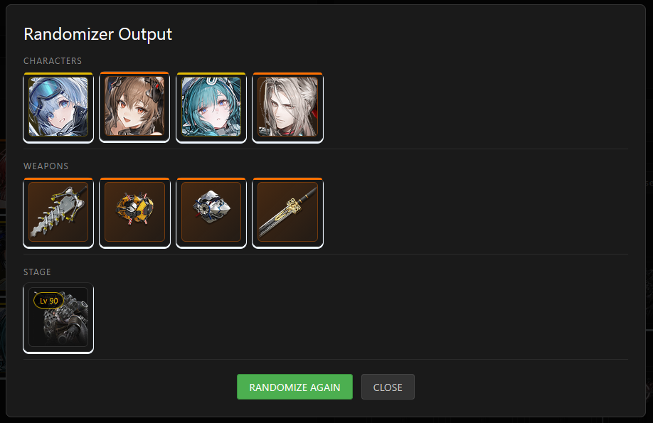

# Arknights: Endfield Randomizer

An interactive tool for creating randomized loadouts.

## Preview

### Main Window

### Randomized Output

## How to Use
1. Open the [Randomizer](https://moques.github.io/randomizer/)
2. Select owned operators and weapons by selecting them.
3. Select Stages or ignore it.
4. Click on the "Randomize" button to generate a random loadout.
